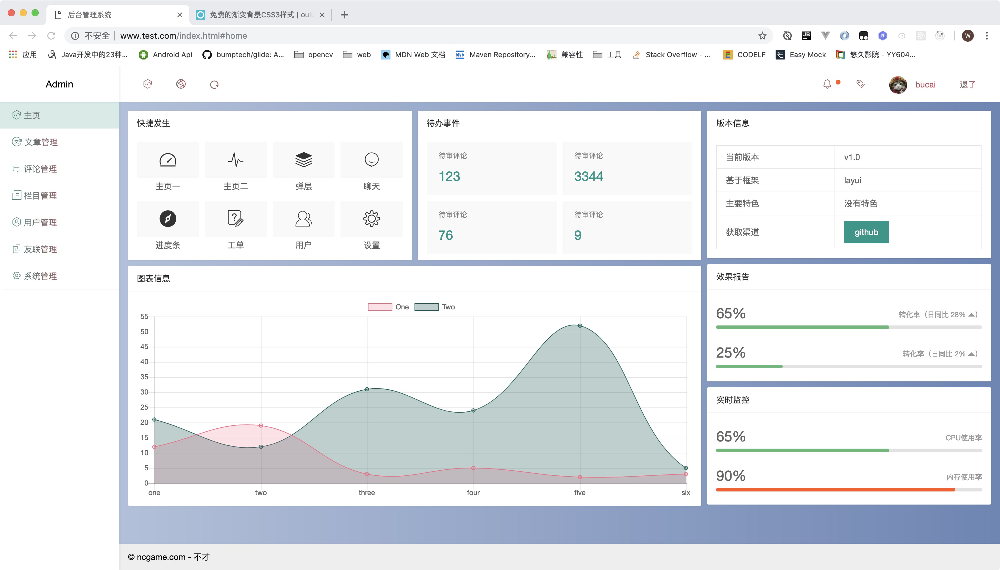
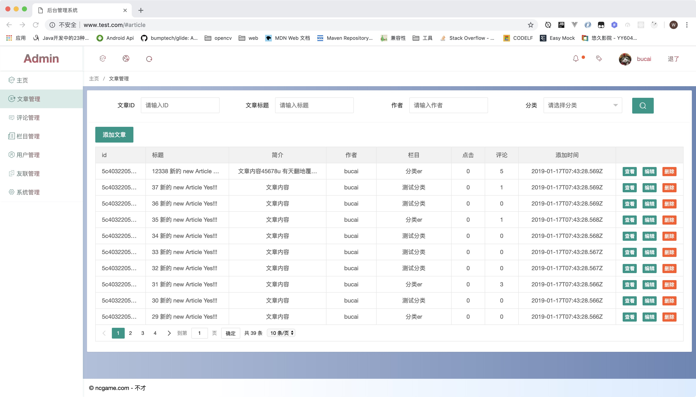

# 基于 layui 后台管理系统

## 目前仅仅实现了自己博客使用的功能

## 项目结构

```
  |- common # 资源目录
    |- js # 所有page 对应的js 和 配置的js
      |- config.js # layui 配置项
      |- simditor 编辑器系列的js
    |- img
    |- css
    |- layui # 框架代码 （修改过ajax 跨域）
  |- page # 二级或三级页面
  |- index.html # 后台的整体`框架`
  |- ~~.js  # 对应的处理
  |- login.html # 登陆
  |- ~~.js  #
```

## `展示`






